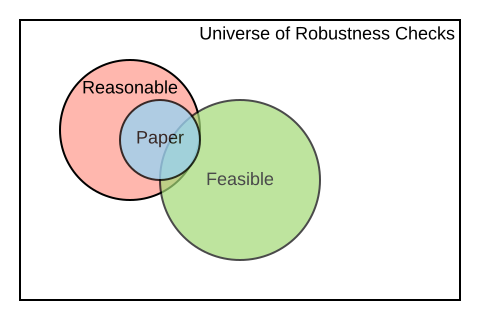

count: false
<style>

.center2 {
  margin: 0;
  position: absolute;
  top: 50%;
  left: 50%;
  -ms-transform: translate(-50%, -50%);
  transform: translate(-50%, -50%);
}


pre.sourceCode {
    max-height: 200px;
    overflow-y: auto;
}


/*
.remark-slide-number {
  position: inherit;
}

.remark-slide-number .progress-bar-container {
  position: absolute;
  bottom: 0;
  height: 4px;
  display: block;
  left: 0;
  right: 0;
}

.remark-slide-number .progress-bar {
  height: 100%;
  background-color: blue;
}
*/
</style>


```{css, echo=FALSE}
# CSS for including pauses in printed PDF output (see bottom of lecture)
@media print {
  .has-continuation {
    display: block !important;
  }
}

```


```{r setup, include=FALSE}
options(htmltools.dir.version = FALSE)
library(knitr)
opts_chunk$set(
  fig.align="center",  
  fig.height=4, #fig.width=6,
  # out.width="748px", #out.length="520.75px",
  dpi=300, #fig.path='Figs/',
  cache=T ,#, 
  echo=F #warning=F, message=F
  )
library(tidyverse)
library(hrbrthemes)
library(fontawesome)

```


# Contenidos

</br>
.font130[

1. [BITSS](#about-bitss)

2. [Transparencia en la Investigación Científica](#ADD)

3. [Problemas y Soluciones](#ADD)

4. [Aplicación al Análisis de Políticas Públicas](#ADD)
]

---
count: false
# Contenidos
</br>
.font130[


1. [**BITSS**](#about-bitss)

2. [Transparencia en la Investigación Científica](#ADD)

3. [Problemas y Soluciones](#ADD)

4. [Aplicación al Análisis de Políticas Públicas](#ADD)
]

---
background-image: url("Images/BITSSlogo.png"), url(Images/cega.png)
background-size: contain, 200px
background-position: 50% 100% , 0% 100% 
name: about-bitss
# Sobre Nosotros
  
  
### [BITSS](https://bitss.org)   

.pull-left[
Berkeley Initiative for Transparency in the Social Sciences trabaja para mejorar la credibilidad de las ciencias al </br> promover transparencia, </br> reproducibilidad, rigor, y </br> ética en la investigación 

.font150[ ACRE  
  

OPA

]

]
.pull-right[ .right[
Somos parte del Center for Effective Global Action ([CEGA](https://cega.berkeley.edu/)).   
 </br></br></br></br>

.font150[   
Talleres y   
Conferencias  

Meta-investigación
]


  ]]
 


 
---
count: false
# Contenidos
</br>
.font130[


1. [BITSS](#about-bitss)

2. [**Transparencia en la Investigación Científica**](#transparencia)

3. [Problemas y Soluciones](#ADD)

4. [Aplicación al Análisis de Políticas Públicas](#ADD)
]


---
name: transparencia

# Ética en la Investigación Científica 

.font120[
- Transparencia es un elemento central de la ética del investigador.  

- Valores científicos acuñados por Robert Merton (Merton 1942):  

  - **Universalismo**: cualquier persona puede presentar un argumento, independiente de su estatus.  
  - **Comunismo/Comunalismo**: el conocimiento es compartido de manera abierta.  
  - **Desinterés**: la verdad como motivación, y no los beneficios monetarios.  
  - **Escepticismo Organizado**: revisión a través de pares (peer review), replicación.
]
---
background-image: url(Images/AMdV2007_1.PNG)
background-size: contain

# En la Practica [(Anderson et al 2007)](http://www.jstor.org/stable/pdf/10.1525/jer.2007.2.4.3.pdf)  

---
background-image: url(Images/AMdV2007_2.PNG)
background-size: contain
count: false

# En la Practica [(Anderson et al 2007)](http://www.jstor.org/stable/pdf/10.1525/jer.2007.2.4.3.pdf)  
---
background-image: url(Images/AMdV2007.PNG)
background-size: contain
count: false

# En la Practica [(Anderson et al 2007)](http://www.jstor.org/stable/pdf/10.1525/jer.2007.2.4.3.pdf)  

---
count: false
# Contenidos
</br>
.font130[


1. [BITSS](#about-bitss)

2. [Transparencia en la Investigación Científica](#transparencia)

3. [**Problemas y Soluciones**](#problemas)

4. [Aplicación al Análisis de Políticas Públicas](#ADD)
]

---
name: problemas

# Problema #1: Sesgo de Publicación

El sesgo de publicacion ocurre cuando los estudios publicados en revistas cientificas estan sobrerepresentados por estudios que obtienen un particular tipo de restultados (eg. rechazan la hipotesis nula). 

Evidencia que sugiere la existencia de sesgo de publicacion:  

- El tamaño de los efectos disminuye con el tamaño muestral ([Gerber et al  2001](http://pan.oxfordjournals.org/content/9/4/385.short)).  


- La publicación de efectos nulos esta desapareciendo en el tiempo, en todas las disciplinas ([Fanelli 2011](http://link.springer.com/article/10.1007/s11192-011-0494-7)).  

Evidencia que mide la magnitud del sesgo de publicación: 

- Estudio que  siguió a experimentos completados muestra que aquellos experimentos con fuertes resultados son 40pp más probable de ser publicados, y 60pp más probable de ser escritos. Alto "file drawer problem". ([Franco et al 2014](http://science.sciencemag.org/content/345/6203/1502)})

- En economía [Andrews and Kasy (2019)](https://www.aeaweb.org/articles?id=10.1257/aer.20180310) estiman que, para algunas literaturas, los estudios que rechazan la nula son entre 3 y 30 (!) veces mas probables de ser publicados en journals top.   
  
---
background-image: url(Images/Tess.PNG)
background-size: contain

# Sesgo de Publicacion en TESS (NSF)   
---

# Problema #2: P-Hacking  
.font120[
- Definición: flexibilidad en el análisis de datos permite presentar *casi cualquier resultado* bajo un umbral arbitrario; significancia estadística pierde sentido.

- Otros nombres: "specification searching" (Leamer 1983), "data-fishing", grados de libertad del investigador, o "data-mining".  

- No implica intencionalidad. Puede ser subconsciente, o simplemente una practica estándar del análisis estadístico ([Gelman and Loken 2013](http://www.stat.columbia.edu/~gelman/research/unpublished/p_hacking.pdf)).

- Evidencia: comportamiento anomalo de test estadisticos entorno a umbrales arbitrarios.
]
---
background-image: url(Images/GerberSoc.PNG), url(Images/GerberPS.PNG)
background-size: 400px, 500px
background-position: 0% 50%, 100% 50%  

# Evidencia: Sociologia y Ciencias Politicas
.pull-left[
Sociología [(Gerber and Malhotra 2008a)](http://smr.sagepub.com/content/37/1/3.short)
]

.pull-right[
Ciencias Políticas [(Gerber and Malhotra 2008b)](http://nowpublishers.com/article/Details/QJPS-8024)
]
---
background-image: url(Images/Brodeur.PNG), url(Images/Brodeur_2.PNG)
background-size: 400px, 500px
background-position: 0% 50%, 100% 50%  

# Evidencia: Economía

.pull-left[
AER, QJE, JPE [(Brodeur et al 2016)](http://ftp.iza.org/dp7268.pdf)
]

.pull-right[
Top-5,  Variables Instrumentales [(Brodeur et al 2020)](https://www.aeaweb.org/content/file?id=12747)
]

---
count:false

# Motivation: Prevent Loss of Knowledge  

Every semester, graduate students around **the world** take an Empirical/Applied [`...`] Economics course. A typical assignment consists of reproducing the results of a paper and, possibly, testing the robustness of its results. 

   

|       Stage       	|                         New Knowledge                        	|
|:-----------------:	|:------------------------------------------------------------:	|
| Scope </br> (select and verify) 	| Data and code exist?                                         	|
| </br></br>            	|  	|
| </br></br>           	|  	|
| </br></br>   	|  </br>          	|

---
count:false

# Motivation: Prevent Loss of Knowledge

Every semester, graduate students around **the world** take an Empirical/Applied [`...`] Economics course. A typical assignment consists of reproducing the results of a paper and, possibly, testing the robustness of its results. 


   

|       Stage       	|                         New Knowledge                        	|
|:-----------------:	|:------------------------------------------------------------:	|
| Scope </br> (select and verify) 	| Data and code exist?                                         	|
| Assess            	| Degree of reproducibility for <br>specific part of the paper 	|
| </br></br>           	|  	|
| </br></br>   	|  </br>          	|

---
count:false 

# Motivation: Prevent Loss of Knowledge  

Every semester, graduate students around **the world** take an Empirical/Applied [`...`] Economics course. A typical assignment consists of reproducing the results of a paper and, possibly, testing the robustness of its results. 


   

|       Stage       	|                         New Knowledge                        	|
|:-----------------:	|:------------------------------------------------------------:	|
| Scope </br> (select and verify) 	| Data and code exist?                                         	|
| Assess            	| Degree of reproducibility for <br>specific part of the paper 	|
| Improve           	| E.g. fixed paths, libraries,<br>added missing files, etc.    	|
| </br></br>   	|  </br>          	|

---
count:false 

# Motivation: Prevent Loss of Knowledge  

Every semester, graduate students around **the world** take an Empirical/Applied [`...`] Economics course. A typical assignment consists of reproducing the results of a paper and, possibly, testing the robustness of its results. 

|       Stage       	|                         New Knowledge                        	|
|:-----------------:	|:------------------------------------------------------------:	|
| Scope </br> (select and verify) 	| Data and code exist?                                         	|
| Assess            	| Degree of reproducibility for <br>specific part of the paper 	|
| Improve           	| E.g. fixed paths, libraries,<br>added missing files, etc.    	|
| Test robustness   	| Results are robust to additional <br>specifications          	|


---

# Motivation: Prevent Loss of Knowledge  
</br>
.font120[
- In each of the previous steps there was valuable new knowledge 
- This knowledge is not usually disseminated  
  - End of semester report, or presentation that is not published. 
  - Language across courses is not standard (reproduction? replication?)
  - Current attempts to record this are closer to a full paper format (see [Replication Wiki](https://replication.uni-goettingen.de/))
- As a result there is a large amount of missed knowledge.  
   - Each new semester, new students repeat similar exercises and have to reinvent the wheel.  
   - Lost opportunity for building on top of previous exercises 
   - Lost opportunity for aggregating the new knowledge.
]


```{r back of envelope, eval=FALSE, include=FALSE}
# --
# 
# - N PhD in Economics around **the world**   
# 
# --
# 
# - Average class size 10
# 
# --
# 
# - Half takes on 2nd year elective of empirical something
# 
# --
# 
# - Each student works 20 hours on averge in a reproduction task
# 
# --
# 
# - Half of the stundents work consist on assessing the reproducibility, and/or improving the current reproducibility
# 
# Each year `r (100 * 10 * .5 * 20 * .5)/1000` thousand hours of knowledge generating work are unrecorded.  
# 

# ---
# # Why conservative?  
# 
 
```


---
count: false  

# Table of Contents  
</br>
.font130[

1. [BITSS](#about-bitss)

2. [Why Reproducibility](#motivation)

3. [**ACRE Guidelines**](#guidelines)

4. [ACRE Platform](#platform)
]

---
name: guidelines

# Context for ACRE

- American Economics Association (AEA) creates first data policy in 2006.  

    - Must publish some data (waivers available)
--

- AEA updates [policy in 2019](https://www.aeaweb.org/journals/policies/data-code/). 
    - Must post all data and code. Publication is conditional on verifying reproducibility (if confidential: must document extensively) 
    - A new requirement is to post all cleaning code, even for data that is not public
    - See the [AEA Data Editor Website](https://aeadataeditor.github.io) for more information 
--

- We should expect high levels of computational reproducibility after 2019 (AEA Journals). 
--

- We should not demand 100% reproducibility before, but we could identify the gaps and try to improve some. 

---

# Beyond Binary Judgments    

Reproductions can easily gravitate towards adversarial exchanges.
  - Early career researcher (ECR) have incentives to emphasize unsuccessful reproductions 
  - Original authors have a more senior position and can use it to deter in-depth reproductions from ECRs. 
  - The media also focuses on eye-catching headlines

--


### Our approach: 

We do not want to say 
 > "Paper X is (ir)reproducible"    
 
  
--
We do want to say 
 > "Result Y in paper X has a high/low level of reproducibility according to several reproduction attempts. Moreover, improvements have been made to the original reproduction package, increasing its reproducibility to a higher level" 

---
count:false 

# Beyond Binary Judgments    

Reproductions can easily gravitate towards adversarial exchanges.
  - Early career researcher (ECR) have incentives to emphasize unsuccessful reproductions 
  - Original authors have a more senior position and can use it to deter in-depth reproductions from ECRs. 
  - The media also focuses on eye-catching headlines


### Our approach: 

We do not want to say 
 > "Paper X is (ir)reproducible"    
 
  

We do want to say 
 > "Result Y in paper X has a high/low **level** of reproducibility according to **several** reproduction attempts. Moreover, **improvements** have been made to the original reproduction package, **increasing** its reproducibility to a higher level" 

  


---
count: true  
background-image: url(Images/paper-claims.svg)
background-size: 610px
background-position: 100% 0%
  
# Our Framework

.pull-left[
.font100[
Each **reproduction attempt** </br>
is centered around scientific </br>
**claims**

One paper can contain  
several claims. 

Each claim may be </br>
supported by various </br>
**display items**: tables, </br> 
figures & inline results.

A reproduction attempt is </br>
at the claim level, and  </br> 
reproducers must record  </br>
their **specifications** of </br>
interest.  
]
                                
                                  
                                DI: Display Item 
                                S: Specificaiton
]
.pull-right[ 
]

```{r diagram, echo = FALSE, eval=FALSE, out.width='170%', retina=2}
library(DiagrammeR)


grViz("
digraph a_nice_graph {

graph [layout = neato, rankdir= TB, overlap=true]  ## layout = [neato|twopi, etc]
#https://rich-iannone.github.io/DiagrammeR/graphviz_and_mermaid.html


# node definitions with substituted label text
node [fontname = Helvetica, shape = box, style=empty ]
paper [label = '@@1']    ## label indicates the position of the letter

node [fontname = Helvetica, shape = diamond, fontsize = 10, fixedsize = TRUE, fillcolor=Gray]
claim1 [label = '@@2-1', color=red]
claim2 [label = '@@2-2']
claim3 [label = '@@2-3']

node [fontname = Helvetica, shape = circle, fillcolor=YellowGreen, fixedsize = TRUE]
output1 [label = '@@3-1', color = red]
output2 [label = '@@3-2']
output3 [label = '@@3-3']
output4 [label = '@@3-4']
output5 [label = '@@3-5']
output6 [label = '@@3-6']

node [fontname = Helvetica, shape = circle, fixedsize = TRUE, fillcolor=Peru]
spec1 [label = '@@4-1', color=red]
spec2 [label = '@@4-2']
spec3 [label = '@@4-3']
spec4 [label = '@@4-4']
spec5 [label = '@@4-5']
spec6 [label = '@@4-6']
spec7 [label = '@@4-7']
spec8 [label = '@@4-8']
spec9 [label = '@@4-9']
spec10 [label = '@@4-10']
spec11 [label = '@@4-11']
spec12 [label = '@@4-12']


# edge definitions with the node IDs
paper -> {claim1} [color=red]      ##[label = ...] adds text on the edge
paper -> {claim2 claim3} 
claim1 -> {output1} [color=red]
claim1 -> {output2} 
claim2 -> {output3 output4}
claim3 -> {output5 output6}
output1 -> {spec1} [color=red]
output1 -> {spec2} 
output2 -> {spec3 spec4}
output3 -> {spec5 spec6}
output4 -> {spec7 spec8}
output5 -> {spec9 spec10}
output6 -> {spec11 spec12}
}

[1]: 'Paper'            ## adds label to each box
[2]: c('Claim 1', 'Claim 2', 'Claim 3')
[3]: c('DI 1' , 'DI 2', 'DI 3', 'DI 4', 'DI 5', 'DI 6')
[4]: paste0('S ', 1:10)

")
```


---
background-image: url(Images/stages.svg)
background-size: contain
names: Stages

# Stages

---
background-image: url(Images/scope.svg)
background-size: contain
count:false
names: Stages

# Stages

---
background-image: url(Images/scope.svg)
background-size: 300px
background-position: 0% 100% 

names: scoping

# Scoping

.pull-left[
1. Select or be assigned a candidate paper

2. Check ACRE Platform for previous entries and verify availability of reproduction package (RP)

3. If no RP, leave a short record, and repeat with a different candidate paper 

4. Once RP is found then candidate becomes declared paper 

5. Only then: read the paper and select claim(s), display items and specification to reproduce 
]

.pull-right[
.font90[
>**Box 1:** Summary Report Card for ACRE Paper Entry     
> **Title:**  Sample Title   
> **Authors:**  Jane Doe & John Doe  
> **Original Reproduction Package Available:** URL/No  
> [If "Yes"]  
> **Additional Reproduction Packages:** Number (eg., 2)   
> [If "No"]  
>**Contacted Authors?:** Yes/No   
> [If "Yes(contacted)"]  
> **Type of Response:** Categories (6).  
> **Authors Available for Further Questions for ACRE Reproductions:** Yes/No/Unknown   
]

]

---
background-image: url(Images/assess.svg)
background-size: 700px
background-position: 50% 20% 


# Assessment 

</br></br></br></br></br></br></br></br>

## Two main parts for assessment: 

.font130[
1. Find all the elements behind a display item
2. Score the reproducibility of that display item 
 ]
---
background-image: url(Images/assess.svg)
background-size: 300px
background-position: 0% 100% 

# .font70[Identify All the Elements Behind a Display Item]

Reproducers will be asked to draw a clear connection to the raw data sources mentioned in the paper and the display item under reproduction. 
--

### Data sources  
Connect the data sources in the paper's text with specific raw data files. 
--

### Analytic data sets  
Describe each analytic data file. 
--

### Code files  
Inspect all code files and record all their inputs and outputs. 

With all the information recorded above, reproducers can use the **ACRE Diagram Builder** to generate a **reproduction tree**. 


---
background-image: url(Images/assess.svg)
background-size: 300px
background-position: 0% 100% 


# Reproduction Tree
.font90[
```md
        table1.tex
            |___[code] analysis.R
                |___analysis_data.dta
                    |___[code] final_merge.do
                        |___cleaned_1_2.dta
                        |   |___[code] clean_merged_1_2.do
                        |       |___merged_1_2.dta
                        |           |___[code] merge_1_2.do
                        |               |___cleaned_1.dta
                        |               |   |___[code] clean_raw_1.py
                        |               |       |___raw_1.dta
                        |               |___cleaned_2.dta
                        |                   |___[code] clean_raw_2.py
                        |                       |___raw_2.dta
                        |___cleaned_3_4.dta
                            |___[code] clean_merged_3_4.do
                                |___merged_3_4.dta
                                    |___[code] merge_3_4.do
                                        |___cleaned_3.dta
                                        |   |___[code] clean_raw_3.py
                                        |       |___raw_3.dta
                                        |___cleaned_4.dta
                                            |___[code] clean_raw_4.py
                                                |___raw_4.dta
```
]
---
count:true
background-image: url(Images/assess.svg)
background-size: 300px
background-position: 0% 100% 

# Levels   
.font90[
```md
                            Levels of Computational Reproducibility
                           (P denotes "partial", C denotes "complete")
    
    
                                       | Availability of materials, and reproducibility |
                                       |------------------------------------------------|
                                       |Analysis| Analysis|     | Cleaning| Raw   |     |
                                       |Code    | Data    | CRA | Code    | Data  | CRR |
                                       | P | C  | P  | C  |     | P  |  C | P | C |     |
                                       ---------|---------|-----|---------|-------|-----|
      L1: No materials.................| -   -  | -    -  |  -  |  -    - | -   - |  -  |
      ---------------------------------|--------|---------|-----|---------|-------|-----|
      L2: Only code ...................| ✔   ✔  | -    -  |  -  |  -    - | -   - |  -  |
      L3: Partial analysis data & code.| ✔   ✔  | ✔    -  |  -  |  -    - | -   - |  -  |
      L4: All analysis data & code.....| ✔   ✔  | ✔    ✔  |  -  |  -    - | -   - |  -  |
      L5: Reproducible from analysis...| ✔   ✔  | ✔    ✔  |  ✔  |  -    - | -   - |  -  |
      ---------------------------------|--------|---------|-----|---------|-------|-----|
      L6: Some cleaning code...........| ✔   ✔  | ✔    ✔  |  ✔  |  ✔    - | -   - |  -  |
      L7: All cleaning code............| ✔   ✔  | ✔    ✔  |  ✔  |  ✔    ✔ | -   - |  -  |
      L8: Some raw data................| ✔   ✔  | ✔    ✔  |  ✔  |  ✔    ✔ | ✔   - |  -  |
      L9: All raw data.................| ✔   ✔  | ✔    ✔  |  ✔  |  ✔    ✔ | ✔   ✔ |  -  |
      L10:Reproducible from raw data...| ✔   ✔  | ✔    ✔  |  ✔  |  ✔    ✔ | ✔   ✔ |  ✔  |
```
]
---
count:false
background-image: url(Images/assess.svg)
background-size: 300px
background-position: 0% 100% 

# Levels   

.font90[
```md
                            Levels of Computational Reproducibility
                           (P denotes "partial", C denotes "complete")
    
    
*                                      | Availability of materials, and reproducibility |
*                                      |------------------------------------------------|
*                                      |Analysis| Analysis|     | Cleaning| Raw   |     |
*                                      |Code    | Data    | CRA | Code    | Data  | CRR |
*                                      | P | C  | P  | C  |     | P  |  C | P | C |     |
                                       ---------|---------|-----|---------|-------|-----|
      L1: No materials.................| -   -  | -    -  |  -  |  -    - | -   - |  -  |
      ---------------------------------|--------|---------|-----|---------|-------|-----|
      L2: Only code ...................| ✔   ✔  | -    -  |  -  |  -    - | -   - |  -  |
      L3: Partial analysis data & code.| ✔   ✔  | ✔    -  |  -  |  -    - | -   - |  -  |
      L4: All analysis data & code.....| ✔   ✔  | ✔    ✔  |  -  |  -    - | -   - |  -  |
      L5: Reproducible from analysis...| ✔   ✔  | ✔    ✔  |  ✔  |  -    - | -   - |  -  |
      ---------------------------------|--------|---------|-----|---------|-------|-----|
      L6: Some cleaning code...........| ✔   ✔  | ✔    ✔  |  ✔  |  ✔    - | -   - |  -  |
      L7: All cleaning code............| ✔   ✔  | ✔    ✔  |  ✔  |  ✔    ✔ | -   - |  -  |
      L8: Some raw data................| ✔   ✔  | ✔    ✔  |  ✔  |  ✔    ✔ | ✔   - |  -  |
      L9: All raw data.................| ✔   ✔  | ✔    ✔  |  ✔  |  ✔    ✔ | ✔   ✔ |  -  |
      L10:Reproducible from raw data...| ✔   ✔  | ✔    ✔  |  ✔  |  ✔    ✔ | ✔   ✔ |  ✔  |
```
]
---
count:false
background-image: url(Images/assess.svg)
background-size: 300px
background-position: 0% 100% 
# Levels   

.font90[
```md
                            Levels of Computational Reproducibility
                           (P denotes "partial", C denotes "complete")
    
    
                                       | Availability of materials, and reproducibility |
                                       |------------------------------------------------|
                                       |Analysis| Analysis|     | Cleaning| Raw   |     |
                                       |Code    | Data    | CRA | Code    | Data  | CRR |
                                       | P | C  | P  | C  |     | P  |  C | P | C |     |
                                       ---------|---------|-----|---------|-------|-----|
*     L1: No materials.................| -   -  | -    -  |  -  |  -    - | -   - |  -  |
      ---------------------------------|--------|---------|-----|---------|-------|-----|
      L2: Only code ...................| ✔   ✔  | -    -  |  -  |  -    - | -   - |  -  |
      L3: Partial analysis data & code.| ✔   ✔  | ✔    -  |  -  |  -    - | -   - |  -  |
      L4: All analysis data & code.....| ✔   ✔  | ✔    ✔  |  -  |  -    - | -   - |  -  |
      L5: Reproducible from analysis...| ✔   ✔  | ✔    ✔  |  ✔  |  -    - | -   - |  -  |
      ---------------------------------|--------|---------|-----|---------|-------|-----|
      L6: Some cleaning code...........| ✔   ✔  | ✔    ✔  |  ✔  |  ✔    - | -   - |  -  |
      L7: All cleaning code............| ✔   ✔  | ✔    ✔  |  ✔  |  ✔    ✔ | -   - |  -  |
      L8: Some raw data................| ✔   ✔  | ✔    ✔  |  ✔  |  ✔    ✔ | ✔   - |  -  |
      L9: All raw data.................| ✔   ✔  | ✔    ✔  |  ✔  |  ✔    ✔ | ✔   ✔ |  -  |
      L10:Reproducible from raw data...| ✔   ✔  | ✔    ✔  |  ✔  |  ✔    ✔ | ✔   ✔ |  ✔  |
```
]
---
count:false
background-image: url(Images/assess.svg)
background-size: 300px
background-position: 0% 100% 
# Levels   

.font90[
```md
                            Levels of Computational Reproducibility
                           (P denotes "partial", C denotes "complete")
    
    
                                       | Availability of materials, and reproducibility |
                                       |------------------------------------------------|
                                       |Analysis| Analysis|     | Cleaning| Raw   |     |
                                       |Code    | Data    | CRA | Code    | Data  | CRR |
                                       | P | C  | P  | C  |     | P  |  C | P | C |     |
                                       ---------|---------|-----|---------|-------|-----|
      L1: No materials.................| -   -  | -    -  |  -  |  -    - | -   - |  -  |
      ---------------------------------|--------|---------|-----|---------|-------|-----|
*     L2: Only code ...................| ✔   ✔  | -    -  |  -  |  -    - | -   - |  -  |
      L3: Partial analysis data & code.| ✔   ✔  | ✔    -  |  -  |  -    - | -   - |  -  |
      L4: All analysis data & code.....| ✔   ✔  | ✔    ✔  |  -  |  -    - | -   - |  -  |
      L5: Reproducible from analysis...| ✔   ✔  | ✔    ✔  |  ✔  |  -    - | -   - |  -  |
      ---------------------------------|--------|---------|-----|---------|-------|-----|
      L6: Some cleaning code...........| ✔   ✔  | ✔    ✔  |  ✔  |  ✔    - | -   - |  -  |
      L7: All cleaning code............| ✔   ✔  | ✔    ✔  |  ✔  |  ✔    ✔ | -   - |  -  |
      L8: Some raw data................| ✔   ✔  | ✔    ✔  |  ✔  |  ✔    ✔ | ✔   - |  -  |
      L9: All raw data.................| ✔   ✔  | ✔    ✔  |  ✔  |  ✔    ✔ | ✔   ✔ |  -  |
      L10:Reproducible from raw data...| ✔   ✔  | ✔    ✔  |  ✔  |  ✔    ✔ | ✔   ✔ |  ✔  |
```
]
---
count:false
background-image: url(Images/assess.svg)
background-size: 300px
background-position: 0% 100% 
# Levels   

.font90[
```md
                            Levels of Computational Reproducibility
                           (P denotes "partial", C denotes "complete")
    
    
                                       | Availability of materials, and reproducibility |
                                       |------------------------------------------------|
                                       |Analysis| Analysis|     | Cleaning| Raw   |     |
                                       |Code    | Data    | CRA | Code    | Data  | CRR |
                                       | P | C  | P  | C  |     | P  |  C | P | C |     |
                                       ---------|---------|-----|---------|-------|-----|
      L1: No materials.................| -   -  | -    -  |  -  |  -    - | -   - |  -  |
      ---------------------------------|--------|---------|-----|---------|-------|-----|
      L2: Only code ...................| ✔   ✔  | -    -  |  -  |  -    - | -   - |  -  |
*     L3: Partial analysis data & code.| ✔   ✔  | ✔    -  |  -  |  -    - | -   - |  -  |
      L4: All analysis data & code.....| ✔   ✔  | ✔    ✔  |  -  |  -    - | -   - |  -  |
      L5: Reproducible from analysis...| ✔   ✔  | ✔    ✔  |  ✔  |  -    - | -   - |  -  |
      ---------------------------------|--------|---------|-----|---------|-------|-----|
      L6: Some cleaning code...........| ✔   ✔  | ✔    ✔  |  ✔  |  ✔    - | -   - |  -  |
      L7: All cleaning code............| ✔   ✔  | ✔    ✔  |  ✔  |  ✔    ✔ | -   - |  -  |
      L8: Some raw data................| ✔   ✔  | ✔    ✔  |  ✔  |  ✔    ✔ | ✔   - |  -  |
      L9: All raw data.................| ✔   ✔  | ✔    ✔  |  ✔  |  ✔    ✔ | ✔   ✔ |  -  |
      L10:Reproducible from raw data...| ✔   ✔  | ✔    ✔  |  ✔  |  ✔    ✔ | ✔   ✔ |  ✔  |
```
]
---
count:false
background-image: url(Images/assess.svg)
background-size: 300px
background-position: 0% 100% 
# Levels   

.font90[
```md
                            Levels of Computational Reproducibility
                           (P denotes "partial", C denotes "complete")
    
    
                                       | Availability of materials, and reproducibility |
                                       |------------------------------------------------|
                                       |Analysis| Analysis|     | Cleaning| Raw   |     |
                                       |Code    | Data    | CRA | Code    | Data  | CRR |
                                       | P | C  | P  | C  |     | P  |  C | P | C |     |
                                       ---------|---------|-----|---------|-------|-----|
      L1: No materials.................| -   -  | -    -  |  -  |  -    - | -   - |  -  |
      ---------------------------------|--------|---------|-----|---------|-------|-----|
      L2: Only code ...................| ✔   ✔  | -    -  |  -  |  -    - | -   - |  -  |
      L3: Partial analysis data & code.| ✔   ✔  | ✔    -  |  -  |  -    - | -   - |  -  |
*     L4: All analysis data & code.....| ✔   ✔  | ✔    ✔  |  -  |  -    - | -   - |  -  |
      L5: Reproducible from analysis...| ✔   ✔  | ✔    ✔  |  ✔  |  -    - | -   - |  -  |
      ---------------------------------|--------|---------|-----|---------|-------|-----|
      L6: Some cleaning code...........| ✔   ✔  | ✔    ✔  |  ✔  |  ✔    - | -   - |  -  |
      L7: All cleaning code............| ✔   ✔  | ✔    ✔  |  ✔  |  ✔    ✔ | -   - |  -  |
      L8: Some raw data................| ✔   ✔  | ✔    ✔  |  ✔  |  ✔    ✔ | ✔   - |  -  |
      L9: All raw data.................| ✔   ✔  | ✔    ✔  |  ✔  |  ✔    ✔ | ✔   ✔ |  -  |
      L10:Reproducible from raw data...| ✔   ✔  | ✔    ✔  |  ✔  |  ✔    ✔ | ✔   ✔ |  ✔  |
```
]
---
count:false
background-image: url(Images/assess.svg)
background-size: 300px
background-position: 0% 100% 
# Levels   

.font90[
```md
                            Levels of Computational Reproducibility
                           (P denotes "partial", C denotes "complete")
    
    
                                       | Availability of materials, and reproducibility |
                                       |------------------------------------------------|
                                       |Analysis| Analysis|     | Cleaning| Raw   |     |
                                       |Code    | Data    | CRA | Code    | Data  | CRR |
                                       | P | C  | P  | C  |     | P  |  C | P | C |     |
                                       ---------|---------|-----|---------|-------|-----|
      L1: No materials.................| -   -  | -    -  |  -  |  -    - | -   - |  -  |
      ---------------------------------|--------|---------|-----|---------|-------|-----|
      L2: Only code ...................| ✔   ✔  | -    -  |  -  |  -    - | -   - |  -  |
      L3: Partial analysis data & code.| ✔   ✔  | ✔    -  |  -  |  -    - | -   - |  -  |
      L4: All analysis data & code.....| ✔   ✔  | ✔    ✔  |  -  |  -    - | -   - |  -  |
*     L5: Reproducible from analysis...| ✔   ✔  | ✔    ✔  |  ✔  |  -    - | -   - |  -  |
      ---------------------------------|--------|---------|-----|---------|-------|-----|
      L6: Some cleaning code...........| ✔   ✔  | ✔    ✔  |  ✔  |  ✔    - | -   - |  -  |
      L7: All cleaning code............| ✔   ✔  | ✔    ✔  |  ✔  |  ✔    ✔ | -   - |  -  |
      L8: Some raw data................| ✔   ✔  | ✔    ✔  |  ✔  |  ✔    ✔ | ✔   - |  -  |
      L9: All raw data.................| ✔   ✔  | ✔    ✔  |  ✔  |  ✔    ✔ | ✔   ✔ |  -  |
      L10:Reproducible from raw data...| ✔   ✔  | ✔    ✔  |  ✔  |  ✔    ✔ | ✔   ✔ |  ✔  |
```
]
---
count:false
background-image: url(Images/assess.svg)
background-size: 300px
background-position: 0% 100% 
# Levels   

.font90[
```md
                            Levels of Computational Reproducibility
                           (P denotes "partial", C denotes "complete")
    
    
                                       | Availability of materials, and reproducibility |
                                       |------------------------------------------------|
                                       |Analysis| Analysis|     | Cleaning| Raw   |     |
                                       |Code    | Data    | CRA | Code    | Data  | CRR |
                                       | P | C  | P  | C  |     | P  |  C | P | C |     |
                                       ---------|---------|-----|---------|-------|-----|
      L1: No materials.................| -   -  | -    -  |  -  |  -    - | -   - |  -  |
      ---------------------------------|--------|---------|-----|---------|-------|-----|
      L2: Only code ...................| ✔   ✔  | -    -  |  -  |  -    - | -   - |  -  |
      L3: Partial analysis data & code.| ✔   ✔  | ✔    -  |  -  |  -    - | -   - |  -  |
      L4: All analysis data & code.....| ✔   ✔  | ✔    ✔  |  -  |  -    - | -   - |  -  |
      L5: Reproducible from analysis...| ✔   ✔  | ✔    ✔  |  ✔  |  -    - | -   - |  -  |
      ---------------------------------|--------|---------|-----|---------|-------|-----|
      L6: Some cleaning code...........| ✔   ✔  | ✔    ✔  |  ✔  |  ✔    - | -   - |  -  |
      L7: All cleaning code............| ✔   ✔  | ✔    ✔  |  ✔  |  ✔    ✔ | -   - |  -  |
      L8: Some raw data................| ✔   ✔  | ✔    ✔  |  ✔  |  ✔    ✔ | ✔   - |  -  |
      L9: All raw data.................| ✔   ✔  | ✔    ✔  |  ✔  |  ✔    ✔ | ✔   ✔ |  -  |
*     L10:Reproducible from raw data...| ✔   ✔  | ✔    ✔  |  ✔  |  ✔    ✔ | ✔   ✔ |  ✔  |
```
]

---
background-image: url(Images/assess.svg)
background-size: 300px
background-position: 0% 100% 

# Levels: Proprietary/Confidential Data 
.font90[
```md
                            Levels of Computational Reproducibility
                               with Proprietary/Confidential Data
                           (P denotes "partial", C denotes "complete")
                                       | Availability of materials, and reproducibility |
                                       |------------------------------------------------|
*                                      |        | Instr.  |     |         | Instr.|     |
                                       |Analysis| Analysis|     | Cleaning| Raw   |     |
                                       |Code    | Data    | CRA | Code    | Data  | CRR |
                                       | P | C  | P  | C  |     | P  |  C | P | C |     |
                                       ---------|---------|-----|---------|-------|-----|
      L1: No materials.................| -   -  | -    -  |  -  |  -    - | -   - |  -  |
      ---------------------------------|--------|---------|-----|---------|-------|-----|
      L2: Only code ...................| ✔   ✔  | -    -  |  -  |  -    - | -   - |  -  |
      L3*: Partial analysis data & code| ✔   ✔  | ✔    -  |  -  |  -    - | -   - |  -  |
      L4*: All analysis data & code....| ✔   ✔  | ✔    ✔  |  -  |  -    - | -   - |  -  |
      L5*: Proof of third party CRA....| ✔   ✔  | ✔    ✔  |  ✔  |  -    - | -   - |  -  |
      ---------------------------------|--------|---------|-----|---------|-------|-----|
      L6: Some cleaning code...........| ✔   ✔  | ✔    ✔  |  ✔  |  ✔    - | -   - |  -  |
      L7: All cleaning code............| ✔   ✔  | ✔    ✔  |  ✔  |  ✔    ✔ | -   - |  -  |
      L8*: Some instr. for raw data....| ✔   ✔  | ✔    ✔  |  ✔  |  ✔    ✔ | ✔   - |  -  |
      L9*: All instr. for raw data.....| ✔   ✔  | ✔    ✔  |  ✔  |  ✔    ✔ | ✔   ✔ |  -  |
      L10*:Proof of third party CRR....| ✔   ✔  | ✔    ✔  |  ✔  |  ✔    ✔ | ✔   ✔ |  ✔  |
```
]
---
count:false
background-image: url(Images/assess.svg)
background-size: 300px
background-position: 0% 100% 

# Levels: Proprietary/Confidential Data 
.font90[
```md
                            Levels of Computational Reproducibility
                               with Proprietary/Confidential Data
                           (P denotes "partial", C denotes "complete")
                                       | Availability of materials, and reproducibility |
                                       |------------------------------------------------|
                                       |        | Instr.  |     |         | Instr.|     |
                                       |Analysis| Analysis|     | Cleaning| Raw   |     |
                                       |Code    | Data    | CRA | Code    | Data  | CRR |
                                       | P | C  | P  | C  |     | P  |  C | P | C |     |
                                       ---------|---------|-----|---------|-------|-----|
      L1: No materials.................| -   -  | -    -  |  -  |  -    - | -   - |  -  |
      ---------------------------------|--------|---------|-----|---------|-------|-----|
      L2: Only code ...................| ✔   ✔  | -    -  |  -  |  -    - | -   - |  -  |
*     L3*: Partial analysis data & code| ✔   ✔  | ✔    -  |  -  |  -    - | -   - |  -  |
*     L4*: All analysis data & code....| ✔   ✔  | ✔    ✔  |  -  |  -    - | -   - |  -  |
      L5*: Proof of third party CRA....| ✔   ✔  | ✔    ✔  |  ✔  |  -    - | -   - |  -  |
      ---------------------------------|--------|---------|-----|---------|-------|-----|
      L6: Some cleaning code...........| ✔   ✔  | ✔    ✔  |  ✔  |  ✔    - | -   - |  -  |
      L7: All cleaning code............| ✔   ✔  | ✔    ✔  |  ✔  |  ✔    ✔ | -   - |  -  |
*     L8*: Some instr. for raw data....| ✔   ✔  | ✔    ✔  |  ✔  |  ✔    ✔ | ✔   - |  -  |
*     L9*: All instr. for raw data.....| ✔   ✔  | ✔    ✔  |  ✔  |  ✔    ✔ | ✔   ✔ |  -  |
      L10*:Proof of third party CRR....| ✔   ✔  | ✔    ✔  |  ✔  |  ✔    ✔ | ✔   ✔ |  ✔  |
```
]
---
count:false
background-image: url(Images/assess.svg)
background-size: 300px
background-position: 0% 100% 

# Levels: Proprietary/Confidential Data 
.font90[
```md
                            Levels of Computational Reproducibility
                               with Proprietary/Confidential Data
                           (P denotes "partial", C denotes "complete")
                                       | Availability of materials, and reproducibility |
                                       |------------------------------------------------|
                                       |        | Instr.  |     |         | Instr.|     |
                                       |Analysis| Analysis|     | Cleaning| Raw   |     |
                                       |Code    | Data    | CRA | Code    | Data  | CRR |
                                       | P | C  | P  | C  |     | P  |  C | P | C |     |
                                       ---------|---------|-----|---------|-------|-----|
      L1: No materials.................| -   -  | -    -  |  -  |  -    - | -   - |  -  |
      ---------------------------------|--------|---------|-----|---------|-------|-----|
      L2: Only code ...................| ✔   ✔  | -    -  |  -  |  -    - | -   - |  -  |
      L3*: Partial analysis data & code| ✔   ✔  | ✔    -  |  -  |  -    - | -   - |  -  |
      L4*: All analysis data & code....| ✔   ✔  | ✔    ✔  |  -  |  -    - | -   - |  -  |
*     L5*: Proof of third party CRA....| ✔   ✔  | ✔    ✔  |  ✔  |  -    - | -   - |  -  |
      ---------------------------------|--------|---------|-----|---------|-------|-----|
      L6: Some cleaning code...........| ✔   ✔  | ✔    ✔  |  ✔  |  ✔    - | -   - |  -  |
      L7: All cleaning code............| ✔   ✔  | ✔    ✔  |  ✔  |  ✔    ✔ | -   - |  -  |
      L8*: Some instr. for raw data....| ✔   ✔  | ✔    ✔  |  ✔  |  ✔    ✔ | ✔   - |  -  |
      L9*: All instr. for raw data.....| ✔   ✔  | ✔    ✔  |  ✔  |  ✔    ✔ | ✔   ✔ |  -  |
*     L10*:Proof of third party CRR....| ✔   ✔  | ✔    ✔  |  ✔  |  ✔    ✔ | ✔   ✔ |  ✔  |
```
]
---
background-image: url(Images/improve.svg)
background-size: 700px
background-position: 50% 20% 


# Improvements 

</br></br></br></br></br></br></br></br>

## Three types of improvements: 

.font130[

1. Improvements at the paper level 
2. Improvements at the display-item level  
3. Specific future improvements   
 ]

---
background-image: url(Images/robust.svg)
background-size: 700px
background-position: 50% 20% 


# Robustness Checks 

</br></br></br></br></br></br></br></br>

## Two main parts for robustness: 

.font130[
1. Increase the number of possible robustness checks
2. Justify the appropriateness of a specific test
 ]
 
---
background-image: url(Images/robust.svg), url("Images/robustness checks.svg")
background-size: 300px, 500px
background-position: 0% 100%, 100% 60%  

# Robustness

**Robustness checks:** any possible change in a computational choice, both in data analysis and data cleaning
--

.pull-left[
**Reasonable specifications** ([Simonsohn et al 2018](https://urisohn.com/sohn_files/wp/wordpress/wp-content/uploads/Paper-Specification-curve-2018-11-02.pdf)): 

 1. Sensible tests of the research question
 2. Expected to be statistically valid, and 
 3. Not redundant with other specifications in the set.

Reproducers will be able to record two types of contributions: 

- Mapping the universe of robustness checks
- Justify a specific robustness check as reasonable
]

---
background-image: url(Images/robust.svg)
background-size: 300px
background-position: 0% 100%

# Robustness & Reproducibility

.pull-left[
Robustness with level 1

```{r out.width = '70%'}
# url
knitr::include_graphics("Images/robustness_lvl0.svg") 
```

Robustness with levels 5-9

```{r out.width = '70%'}
# url
 
```

]

.pull-left[
Robustness with levels 2-4

```{r out.width = '70%'}
# url
knitr::include_graphics("Images/robustness_lvl2_4.svg") 
```


Robustness with level 10

```{r out.width = '70%'}
# url
knitr::include_graphics("Images/robustness_lvl10.svg") 
```


]

---

# Promoting a Constructive Exchange 

#### 1 - Contacting the original author(s) when there is no reproduction package
#### 2 - Contacting the original author(s) to request specific missing items of a reproduction package
#### 3 - Asking for additional guidance when some materials have been shared  
#### 4 - Response when the original author has refused to share due to *undisclosed reasons*   
#### 5 - Response when the original author has refused to share due to legal or ethical restrictions of the data
#### 6 - Contacting the original author to share the results of your reproduction exercise
#### 7 - Responding to hostile responses from original authors

#### Under development: sample responses form authors to reproducers

---

# .font80[Example 1: Following up on additional materials]

**Template email:**  

>**Subject:** Clarification for reproduction materials for `[“Title of the paper”]`  

>Dear Dr. `[Lastname of Corresponding Author]`,
>
>Thank you for sharing the materials. They have been immensely helpful for my work.
>
>Unfortunately, I ran into a few issues as I delved into the reproduction exercise, and I think your guidance would be helpful in resolving them. `[Describe the issues and how you have tried to resolve them. Describe whatever files or parts of the data or code are missing. Refer to examples 1 and 2 below for more details]`.  
>  
>Thank you in advance for your help.
>  
>Best regards,  
>`[Reproducer]`  

---
count:false
# .font80[Example 1: Following up on additional materials]

**Template email:**  

>**Subject:** Clarification for reproduction materials for `[“Title of the paper”]`  

>Dear Dr. `[Lastname of Corresponding Author]`,
>
>Thank you for sharing the materials. They have been immensely helpful for my work.
>
>Unfortunately, I ran into a few issues as I delved into the reproduction exercise, and I think your guidance would be helpful in resolving them. **`[Describe the issues and how you have tried to resolve them. Describe whatever files or parts of the data or code are missing. Refer to examples 1 and 2 below for more details]`**.  
>  
>Thank you in advance for your help.
>  
>Best regards,  
>`[Reproducer]`  


---

# An example of well described issues:

.font80[
>Specifically, I am attempting to reproduce [`display item X (e.g., table 1, figure 3)`]. I found that the following components are required to reproduce to reproduce [`display item X `]:     

```md
         display_item_X
            └───[code] formatting_table1.R
                ├───output1_part1.txt  
                |   └───[code] output_table1.do           
                |       └───[data] analysis_data01.csv
                |          └───[code] data_cleaning01.R*
                |             └───[data] UNKNOWN
                └───output1_part2.txt  
                    └───[code] output_table2.do           
                        └───[data] analysis_data02.csv
                           └───[code] data_cleaning02.R
                              └───[data] admin_01raw.csv* 
```

>I have marked with an asterisk (\*) the items that I could not find in the reproduction materials: data_cleaning01.R and admin_01raw.csv. After accessing these files, I will also be able to identify the name of the raw data set required to obtain output1_part1.txt. This is to let you know that I may need to contact you again if I cannot find this file (labeled as UNKNOWN above) in the reproduction materials.
>
>I understand that this request will require some work for you or somebody in your research group, but I want to assure you that I will add these missing files to the reproduction package for your paper on the ACRE platform. Doing this will ensure that you will not be asked twice for the same missing file.
]

---
count:false 

# An example of well described issues:

.font80[
>Specifically, I am attempting to reproduce [`display item X (e.g., table 1, figure 3)`]. I found that the following components are required to reproduce to reproduce [`display item X `]:     

```md
         display_item_X
            └───[code] formatting_table1.R
                ├───output1_part1.txt  
                |   └───[code] output_table1.do           
                |       └───[data] analysis_data01.csv
*               |          └───[code] data_cleaning01.R*
*               |             └───[data] UNKNOWN
                └───output1_part2.txt  
                    └───[code] output_table2.do           
                        └───[data] analysis_data02.csv
                           └───[code] data_cleaning02.R
*                             └───[data] admin_01raw.csv* 
```

>I have marked with an asterisk (\*) the items that I could not find in the reproduction materials: **data_cleaning01.R** and **admin_01raw.csv**. After accessing these files, I will also be able to identify the name of the raw data set required to obtain output1_part1.txt. This is to let you know that I may need to contact you again if I cannot find this file (labeled as **UNKNOWN** above) in the reproduction materials.
>
>I understand that this request will require some work for you or somebody in your research group, but I want to assure you that I will add these missing files to the reproduction package for your paper on the ACRE platform. **Doing this will ensure that you will not be asked twice for the same missing file.**
]

---

# Easy to grade: report 1 

<object data="Images/03_report_card_PS1.pdf" type="application/pdf" width="850px" height="500px">
    <embed src="Images/03_report_card_PS1.pdf">
        <p>This browser does not support PDFs. Please download the PDF to view it: <a href="Images/03_report_card_PS1.pdf">Download PDF</a>.</p>
    </embed>
</object>

---

# Easy to grade: report 1 

.pull-left[
<object data="Images/03_report_card_PS1.pdf" type="application/pdf" width="400px" height="500px">
    <embed src="Images/03_report_card_PS1.pdf">
        <p>This browser does not support PDFs. Please download the PDF to view it: <a href="Images/03_report_card_PS1.pdf">Download PDF</a>.</p>
    </embed>
</object>
]

.pull-left[
<object data="Images/Donaldson_RRRaj_AER.pdf" type="application/pdf" width="400px" height="500px">
    <embed src="Images/Donaldson_RRRaj_AER.pdf">
        <p>This browser does not support PDFs. Please download the PDF to view it: <a href="Images/Donaldson_RRRaj_AER.pdf">Download PDF</a>.</p>
    </embed>
</object>
]


---
# .font80[Suggested timelines for different formats]

</br></br>
<style type="text/css">
.tg  {border-collapse:collapse;border-spacing:0;}
.tg td{font-family:Arial, sans-serif;font-size:18px;padding:10px 5px;border-style:solid;border-width:1px;overflow:hidden;word-break:normal;border-color:black;}
.tg th{font-family:Arial, sans-serif;font-size:18px;font-weight:normal;padding:10px 5px;border-style:solid;border-width:1px;overflow:hidden;word-break:normal;border-color:black;}
.tg .tg-baqh{text-align:center;vertical-align:top}
.tg .tg-c3ow{border-color:inherit;text-align:center;vertical-align:top}
.tg .tg-0pky{border-color:inherit;text-align:left;vertical-align:top}
.tg .tg-dvpl{border-color:inherit;text-align:right;vertical-align:top}
.tg .tg-0lax{text-align:left;vertical-align:top}
</style>
<table class="tg">
  <tr>
    <th class="tg-0pky"></th>
    <th class="tg-c3ow" colspan="2">2 weeks <br> (~10 days)</th>
    <th class="tg-c3ow" colspan="2">1 month <br> (~20 days)</th>
    <th class="tg-c3ow" colspan="2">1 semester <br> (~100 days)</th>
  </tr>
  <tr>
    <td class="tg-0pky"></td>
    <td class="tg-0pky">analysis data</td>
    <td class="tg-0pky">raw data</td>
    <td class="tg-0pky">analysis data</td>
    <td class="tg-0pky">raw data</td>
    <td class="tg-0pky">analysis data</td>
    <td class="tg-0pky">raw data</td>
  </tr>
  <tr>
    <td class="tg-0pky">Scoping</td>
    <td class="tg-c3ow" colspan="2">10% (1 day)</td>
    <td class="tg-c3ow" colspan="2">5% (1 day)</td>
    <td class="tg-c3ow" colspan="2">5% (5 days)</td>
  </tr>
  <tr>
    <td class="tg-0pky">Assessment</td>
    <td class="tg-c3ow" colspan="2">35%</td>
    <td class="tg-c3ow" colspan="2">25%</td>
    <td class="tg-c3ow" colspan="2">15%</td>
  </tr>
  <tr>
    <td class="tg-0pky">Improvement</td>
    <td class="tg-c3ow">25%</td>
    <td class="tg-c3ow">0%</td>
    <td class="tg-c3ow" colspan="2">40%</td>
    <td class="tg-c3ow">20%</td>
    <td class="tg-c3ow">30%</td>
  </tr>
  <tr>
    <td class="tg-0pky">Robustness</td>
    <td class="tg-c3ow">25%</td>
    <td class="tg-c3ow">5%</td>
    <td class="tg-c3ow" colspan="2">25%</td>
    <td class="tg-c3ow" colspan="2">25%</td>
  </tr>
</table>

---
count: false
# Table of Contents  
</br>
.font130[

1. [BITSS](#about-bitss)

2. [Why Reproducibility](#motivation)

3. [ACRE Guidelines](#guidelines)

4. [**ACRE Platform**](#platform)
]
---
background-image: url(Images/Homepage.png)
background-size: contain 
name: platform
#  [socialsciencereproduction.org](https://www.socialsciencereproduction.org)

---

# Ok, I Am Interested. What's Next?

You can check the ACRE Guidelines, and also contribute if you want: https://bitss.github.io/ACRE/

```{r eval = TRUE, echo=FALSE}
knitr::include_url("https://bitss.github.io/ACRE/", height = "350px")
```

.center[
A beta version of the platform will be online by early November 
.font120[
[**Sign up here**](https://forms.gle/yZivWcwijCzEhrBU6) 
]
if you would like to be part of our beta in the fall. 
]


---
class: center, middle
count: false

.font180[**Acknowledgements**]  

</br>

--

Arnold Ventures

--

Everybody who has participated in the pilots so far: 

--

Ted Miguel's Graduate Development Economic Course (2019, 2020) - UC Berkeley

--

Dina Pomeranz undergraduate thesis for Marc Richter - University of Zurich  

--

Slides template:  [Grant McDermott](https://github.com/uo-ec510-2020-spring/lectures).   


```{r gen_pdf, include = FALSE, cache = FALSE, eval = FALSE}
pagedown::chrome_print("01_slides.html", output = "01_slides.pdf")
```